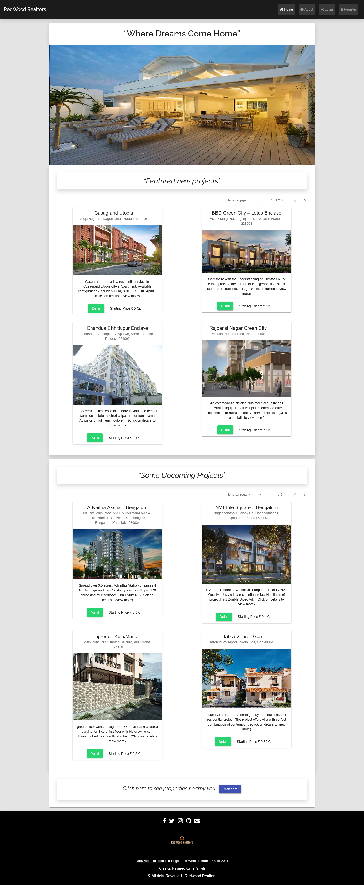

# Sdp-project

This project is related to "real estate management system" in this project we built a smart web app. This app is used by customers who want to buy or sell or rent a property In this project we are going to implement scrum process model In this we will have three types of users buyer or seller and a real-estate dealer and admin. The user and real-estate dealer are going to register and create profile in the web app . The user is able to buy the properties and the photos of the estates are available on the website. 
They are able to see the details of each property and their prices. The user can sell or rent their property and they can upload the photos and details of their property.

#Tech Stack used:- 
Angular, mongodb, nodejs with Expressjs

# Project URL :-
https://redwood-realtor.herokuapp.com/home

# Screenshots :- 

  

